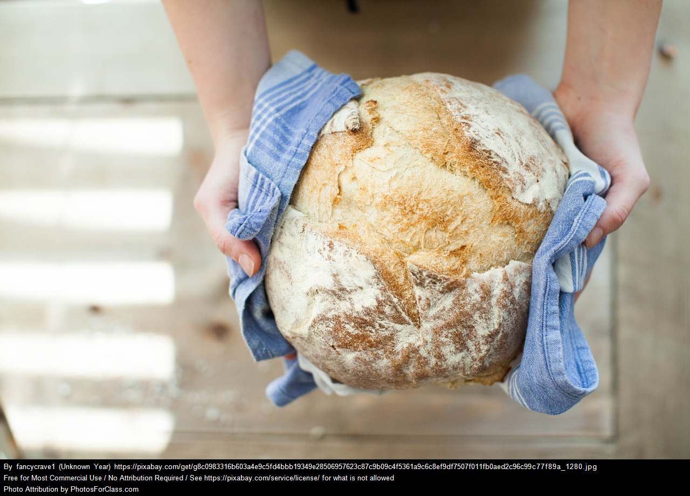

+++
title = "Overview post"
date = 2022-05-01
+++

# Texturist

## Reasons for writing this

I thought my wife was a super picky eater.  I love to cook as a hobby, and figured I was up for the challenge.  We had kids.
Kids have mostly the same food hang-ups. "Learned behaviors" I hear you muttering.  No, some of this pickiness was baked in.  Some of my co-workers in tech, anicdotily,
 have similar food prefernece issues.  I started coming up with the ("rules")[/rules] to help me make meals that weren't gag-inducing.

I went looking for others comments on a correlation between food texture objections and being on the spectrum.  I found a [paper](https://www.ncbi.nlm.nih.gov/pmc/articles/PMC6715205/) about the impacts of being on the spectrum to health/wellness. It contains some comments
from participants about texture that sound eerily familar. Maybe I should write down some of what I've learned cooking for three texture obsessed folks.

We use the term "texture sensitive" to describe these preferences.
It's not terribly precise, but hopefully does imparts a level of empathy that I need to get my family to eat.

I'm recording recipes that have gone over well, and some that haven't. Most are mainstream recipes, with a twist to adapt to a loose set of [rules](/rules) about texture.  As a foodie, these rules violate
 what I've learned about good cooking, and so I will put in "coping mechanism" add-ons, to serve as side dishes or banned sauces to help the foodie in me enjoy mealtime without resentment.
 your favorite pickle.

