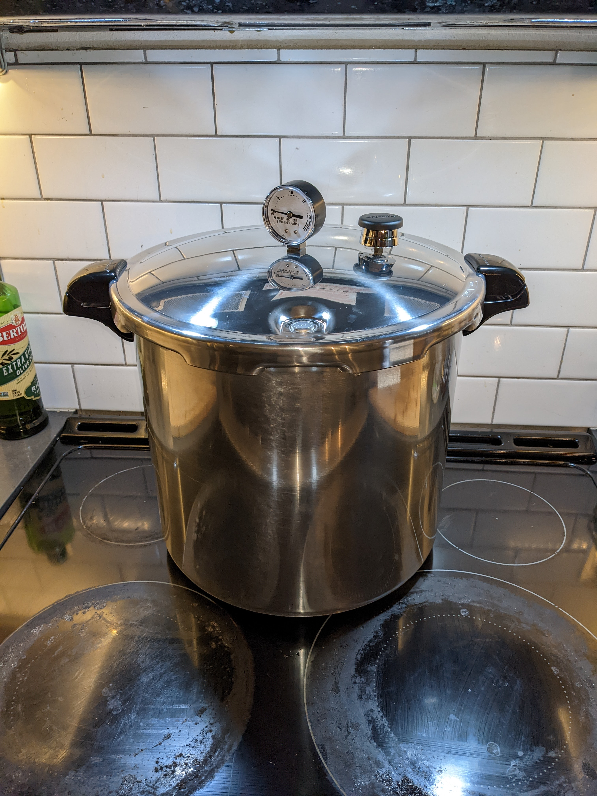

+++
title = "Barbacoa"
date = 2022-05-03

[taxonomies]
categories = ["recipe"]
tags = ["main", "meat", "dry", "strong"]
+++

We affectionately refer to this as "Mexican pulled pork". My take is a little more work than the traditional, but packs in even more smoky goodness.

<!-- more -->

When I volunteered to cook a taco bar lunch for the teaching staff at my wife's school, I decided I needed
something a little more authentic.  I did a practice barbacoa pork shoulder and was impressed-
without sauce, this is way better than traditional pulled pork.

Juicy, a little bit of heat in the back of the mouth, but you can control the heat by not adding too much broth back in.

### Ingredients

- Bone-in pork shoulder (4.5kg / 10 lbs)

### Equipment

- Pressure cooker or instant pot
- smoker (optional)

#### Marinade

- Can of chipotle peppers in adobo
- 1 onion
- 1 head of garlic
- 10 cloves
- 4 bay leaves
- 500ml stock
- 200gr pink salt
- juice of 3-4 limes
- 3-4 pinches of oregano

### Prep steps

Place the port shoulder in a high sided casserole, fat cap down. Rub it all over with pink salt and place it in the refrigerator uncovered to dry out 1 week.

Wash off the salt by gentle rubbing it all over with a wet hand.

(Optional) Smoke for 4 hours at 225F with pecan chips. If you don't want to  bother, add a few splashes of liquid smoke to the marinade.

Make the marinade by blending the chipotle, adobo, onion, garlic, salt, lime juice and cloves together.

Place in a marinade bag or large bowl, fat cap down.  Pour marinade all over it and add water or more stock to cover, as well as bay leaves. Tie
 the marinade bag or cover with a lid- we don't want it to dry any more. Let rest in fridge for 24-48 hours.

Move the pork to an instant pot/pressure cooker fat cap up.  Pour the marinade over it to cover.  Pressure cook for 3 hours (instant pot) or 2 hour at 15lbs of pressure in a stove top pressure cooker.

Remove the meat from the pot and pull it apart, removing the bone, fat and any connective tissue.

Strain the liquid from the pressure cooker.  Taste it- if it's super spicy or salty, thin with water to taste, then add back to the meat 1-200ml, or until the meat is moist.

### Servings

At about 120gr/person, this yields around 16 servings. 
