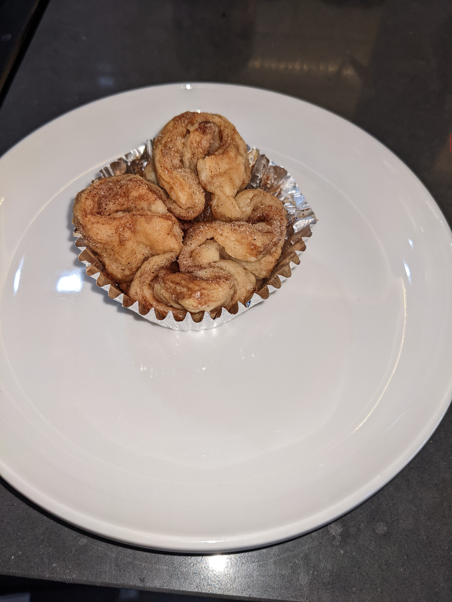
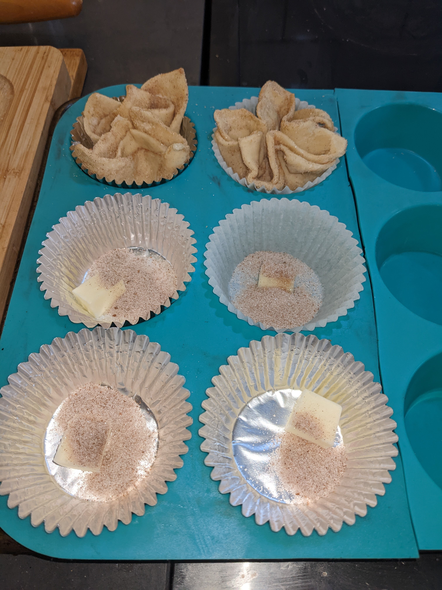
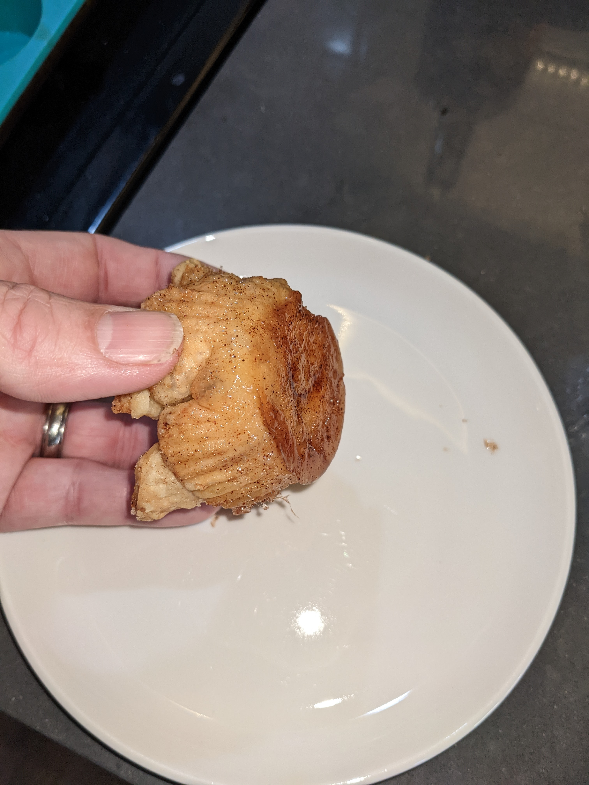

+++
title = "Kouign-Amann"
date = 2022-05-27

[taxonomies]
categories = ["recipe"]
tags = ["breakfast", "crunchy", "dry"]
+++

Fancy pastries, with a carmel bottom

<!-- more -->

There is a bit of technique in getting the shape just right, but it's easier than it looks.

I would like to credit the TV chef that I learned this from, but I'm old and have seen too many.

### Ingredients

- Package of frozen puff pastry
- stick of butter
- 1/2 C white sugar
- 2 T of ground cinnamon

### Steps

Pre-heat the oven to 375 F.

Get a large muffin pan ready, with 12 spots and either muffin tins or silicone.

Cut the butter into 1 T "Pats", then cut each of those into fourths.  We need 24 little tiny cubes total.

Place a tiny cube of butter in the bottom of each muffin tin.

Defrost and lay out the puff pastry on a cutting board.  Use a rolling pin to spread it out just a bit.
The puff pastry I've been using isn't square, so I cut them into 12 rectangles, so 3x4.

Mix the sugar and cinnamon in a small shallow casserole

#### Repeat 12 times...

take one rectangle of pastry and press it firmly into the sugar/cinnamon mixture. flip it over and repeat.
slide it aside and do the same with a second rectangle of pastry.

Place one of them over the top of the other, rotated like 45 degrees, so their points don't line up.

Swish them around so a little bit of sugar mixture is on top of the dough, then place a tiny cube of butter in the middle.

using both hands in a pinching motion, bring the points together and press gently.

The goal is to have it look somewhat like a flower.

When you're all done filling the muffin tins, grab a spoon and with the sugar mixture, dust about 1 T down into the crevices of the pastry.

Turn the oven down to 325F and place them in for 55min.

If the temperature/time was right, you should be rewarded with a crunchy pastry and a slightly carmelized bottem/inside.

