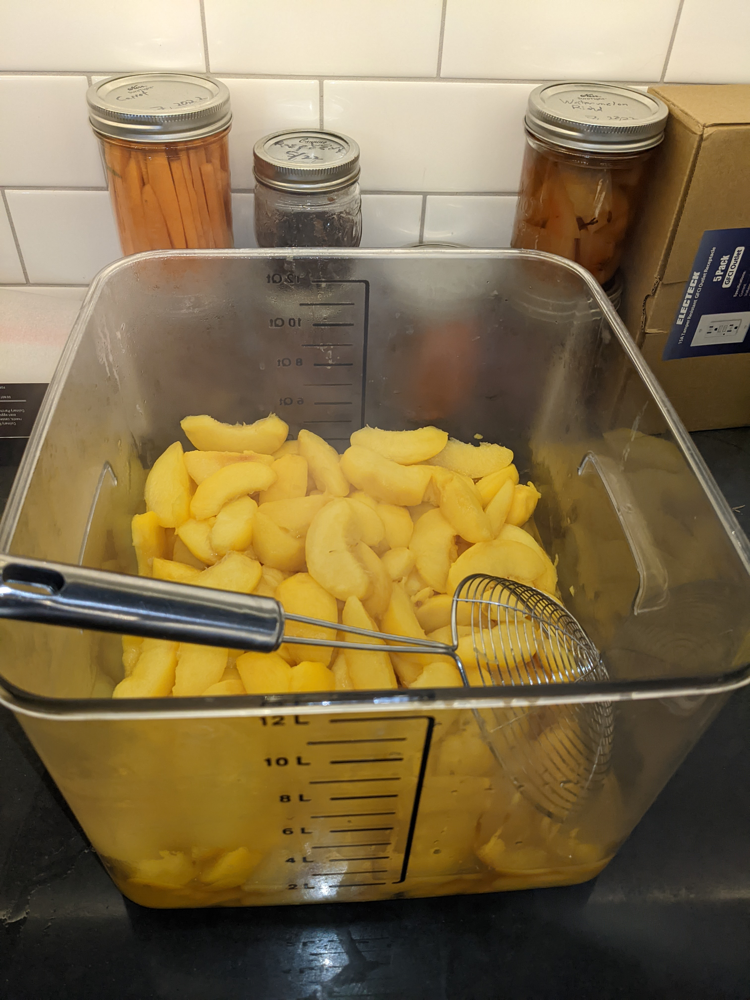
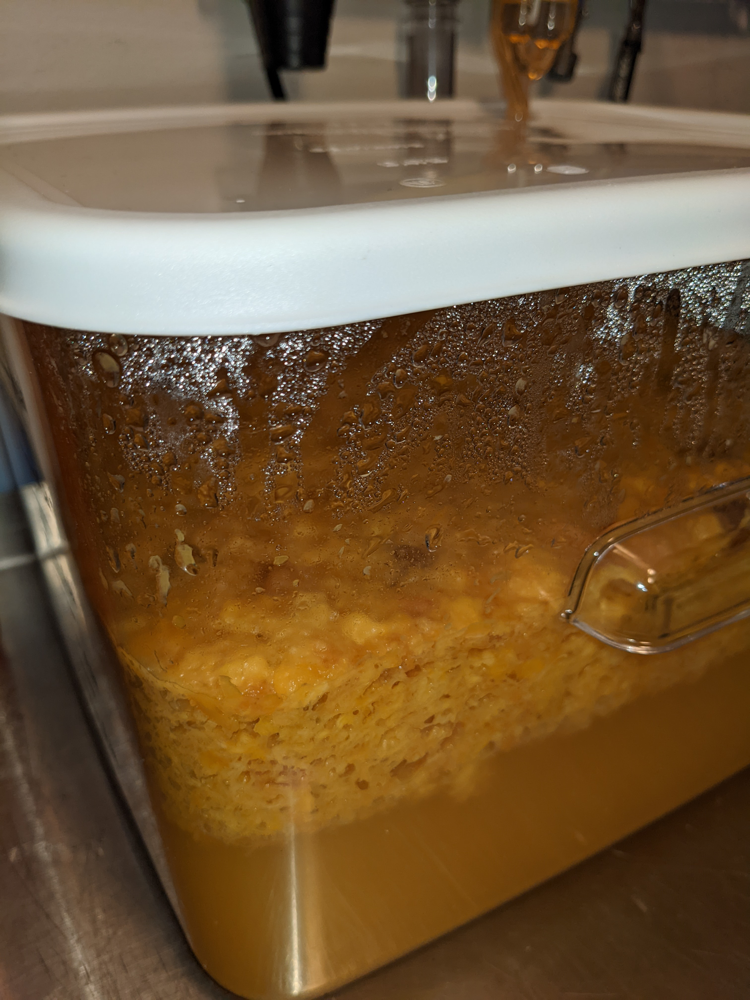
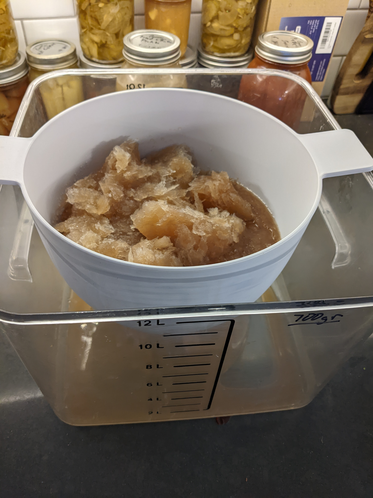

+++
title = "Peach Jack"
date = "1970-01-01"

[taxonomies]
categories = ["recipe"]
tags = ["side", "dessert", "gross", "vegan","gf"]
+++

"Jacking", or freeze distilation, creates a fortified wine, which in the case of peaches, really preserves the taste of summer.

<!-- more -->

### Ingredients

- box of Peaches (prefer free-stones like coral star)
- Sugar
- Champaign yeast (Red star)
- rasins
- 1 C strong black tea

### Steps

(We're skipping over some of the nuances of home wine making, like sanitation and equipment, so if you've never made wine before, consider reading a beginners guide first.)

Weigh the fermentation container and the fruit, record for later.

Skin and remove the stones from the peaches.  Slicing isn't nessisary as we're going to just mash them. Optionally, you can use an immersion blender to break up the fruit. Add the raisins and tea and cover to let things settle for 24 hours.

Add the sugar, using the weight from before, at a rate of 45% of the original weight.  Stir in the yeast and cover with an lid and air-lock. Place in a warm area and check back in 24 hours, there should be bubbles.

Primary fermentaiton should take around 30-45 days, depending on the temperature.  Give the slurry a stir every once in a while.

Most wine recipes call for racking and secondary fermentation, and while we're still learning, the two batches we've made have never produced any gas durring secondary.  We're suggesting skipping secondary and racking, for jacked wine,
we've noticed this doesn't really add anything- the straining process removes some of the nasty bits and because we skinned the fruit, there isn't anything to clog up the strainer.

For jacking, measure out enough slurry to fill your strainer.  In the photo, it holds 2 liters. So working in batches, freeze the slurry, then place in a strainer over a clear container with measuring lines. We're looking for 50% of the liquid to be alchahol and syrup, or 1 liter. We've been discarding the frozen slurry and bottling the liquid that passed through the strainer. 

### Yeild

We got around 4 liters of Peach Jack from a box of peaches.  ABV and sugar levels still need measuring...

### Credit

Starting point for this was [Practical Selfreliance](https://practicalselfreliance.com/peach-wine/)
