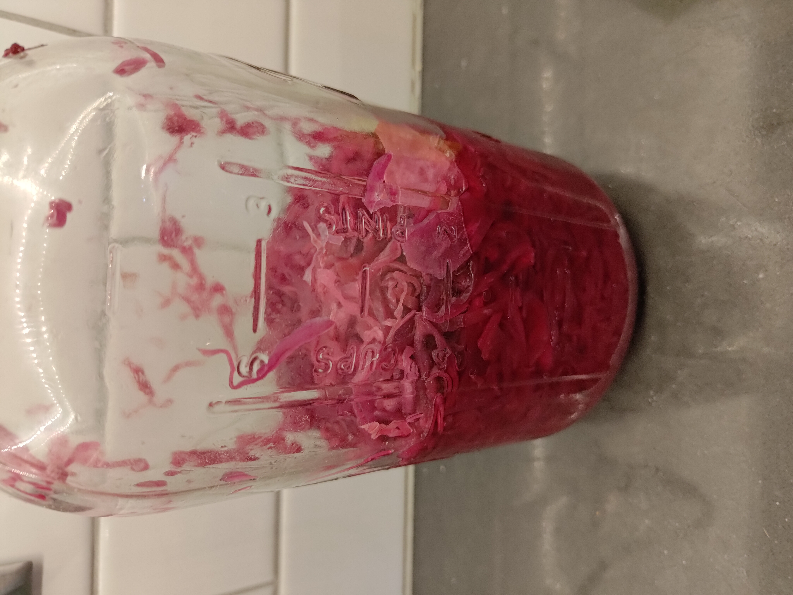

+++
title = "Sauerkraut"
date = 2022-06-23

[taxonomies]
categories = ["recipe"]
tags = ["side", "strong", "acidic"]
+++

Not for everyone.

<!-- more -->

### Ingredients

- ~50-75g Pink salt
- Head of purple cabbage
- 1 onion
- Burp valve jar lids

Take an outer leaf of cabbage off and save as a 'lid'.

Don't wash the cabbage, we're relying on nature for this ferment.

Chop the onion and cabbage into thin strips.
Put into a large mixing container after recording the weight of the container.

Weigh the chopped cabbage/onion, subtract the weight of the container, then multiple by 2.5%

Use the 2.5% number to weight out the salt. Add the salt to the mixture and mix with your hands.

The cabbage will start to 'sweat' after a few minutes of mixing.

Put in a large jar and add ~1C warm water if the cabbage came from the grocery store (not fresh).

Cut the outer leaf into a circle to use as a lid and place it on top of the cabbage.

Put a Ziploc baggie on top and fill with water as a weight.

Put the burp lid on top and set in a warm spot in the kitchen (I'm not in a warm climate).

Let it ferment for ~2 weeks, then test it and put in the fridge. 

General advice is 6 months. Mine never lasts that long.

### How to use saurkraut?

- Reuben sandwhiches
- In salads
- With shaved apple and brautwurst
